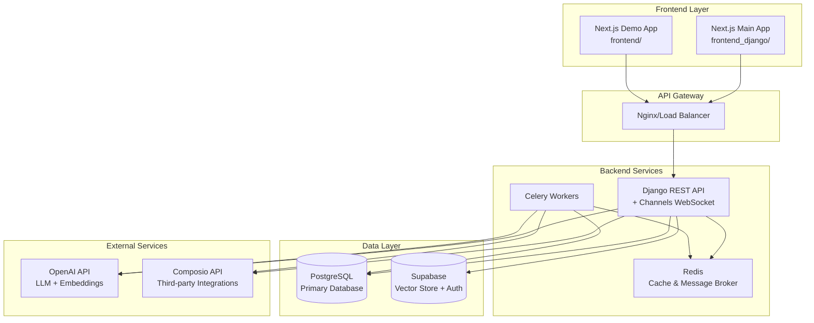
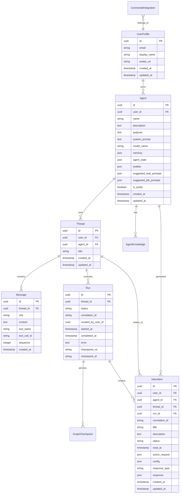
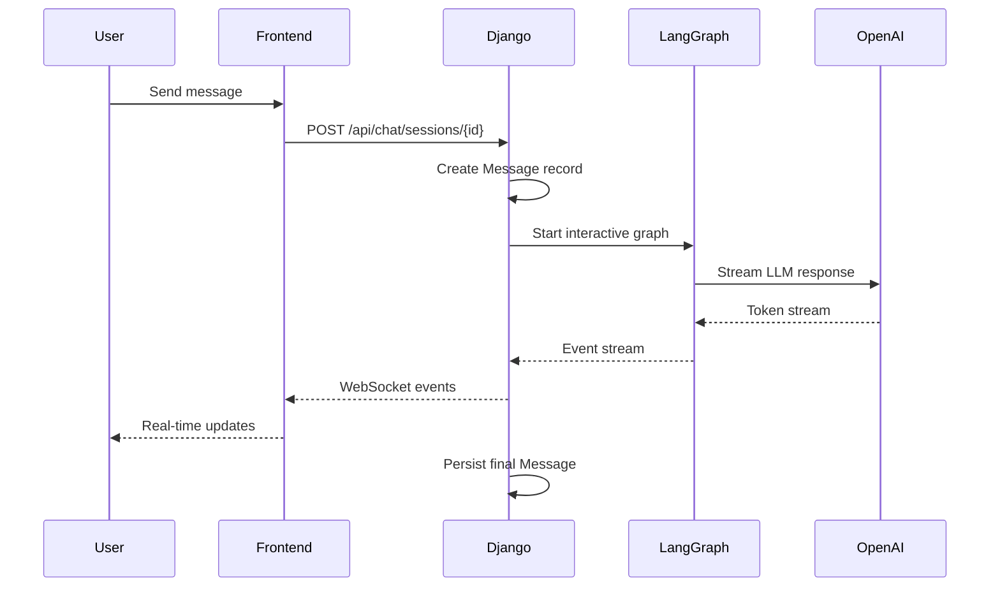
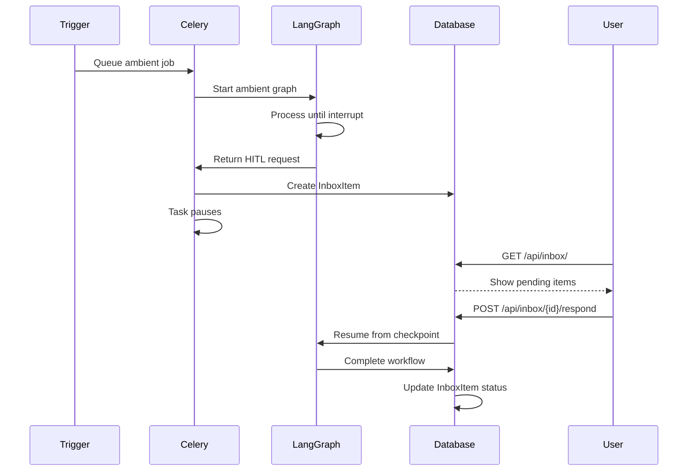

# Design Document

## Overview

The Agent Studio Platform is architected as a full-stack monorepo with a Django REST API backend, Next.js frontend applications, and supporting infrastructure for real-time communication, background processing, and vector-based knowledge management. The system leverages modern technologies including LangGraph for agent workflows, Supabase for authentication and vector storage, Composio for third-party integrations, and Celery for background job processing.

## Architecture

### High-Level Architecture



### System Components

#### Frontend Applications
- **Main Application** (`frontend_django/`): Production Next.js 15 app with App Router, connected to Django backend
- **Demo Application** (`frontend/`): Standalone demo with direct OpenAI + Composio API routes for testing

#### Backend Services
- **Django REST API**: Core application server with DRF for REST endpoints
- **Django Channels**: WebSocket support for real-time chat streaming
- **Celery Workers**: Background job processing for ambient agents and long-running tasks
- **Redis**: Message broker for Celery and caching layer for Channels

#### Data Storage
- **PostgreSQL**: Primary relational database for all application data
- **Supabase Vector Store**: Vector embeddings storage for knowledge management
- **Supabase Auth**: JWT-based authentication service

## Components and Interfaces

### Backend Django Apps

#### 1. Authentication (`authx/`)
**Purpose**: Handle Supabase JWT authentication and user management

**Key Components**:
- `SupabaseBearerAuthentication`: DRF authentication class for JWT validation
- `UserProfile` model: Minimal user profile linked to Supabase user ID
- Middleware for JWT validation and user context

**Interfaces**:
```python
# Authentication endpoints
POST /api/auth/login
POST /api/auth/signup  
POST /api/auth/logout
GET  /api/auth/me
```

#### 2. Agents (`agents/`)
**Purpose**: Core agent management, configuration, and execution

**Key Components**:
- `Agent` model: Agent configuration with toolkits, prompts, and settings
- `AgentKnowledge` model: Knowledge base summaries per agent
- `AgentViewSet`: CRUD operations for agent management
- Graph factory services for LangGraph workflow creation

**Interfaces**:
```python
# Agent management
GET    /api/agents/                    # List user's agents
POST   /api/agents/                    # Create new agent
GET    /api/agents/{id}/               # Get agent details
PUT    /api/agents/{id}/               # Update agent
DELETE /api/agents/{id}/               # Delete agent

# Agent setup and operations
POST   /api/agents/finalize-setup     # Save toolkit connections
POST   /api/agents/{id}/ambient-test  # Queue ambient job
POST   /api/agents/{id}/knowledge/upload  # Upload knowledge documents
```

#### 3. Chat (`chat/`)
**Purpose**: Real-time chat interface and conversation management

**Key Components**:
- `Thread` model: Conversation containers linked to users and agents
- `Message` model: Individual chat messages with role-based typing
- `Run` model: Execution instances with status lifecycle
- `GraphCheckpoint` model: LangGraph state persistence
- `ChatConsumer`: WebSocket consumer for real-time streaming

**Interfaces**:
```python
# REST endpoints
GET  /api/chat/sessions               # List chat threads
POST /api/chat/sessions               # Create new thread
GET  /api/chat/sessions/{id}          # Get thread with messages
POST /api/chat/sessions/{id}          # Add message to thread
POST /api/chat/interactive/stream     # Start streaming chat

# WebSocket
WS   /ws/chat/{thread_id}/            # Real-time chat streaming
```

**WebSocket Event Schema**:
```typescript
type ChatEvent = 
  | { type: "run_status", status: "running" | "end" }
  | { type: "message_delta", delta: string }
  | { type: "tool_call", name: string, args: object }
  | { type: "tool_result", result: any, tool_call_id: string }
```

#### 4. Toolkits (`toolkits/`)
**Purpose**: Composio toolkit discovery and management

**Key Components**:
- Toolkit listing and caching services
- Tool discovery for agent configuration
- Integration with Composio API for real-time data

**Interfaces**:
```python
GET /api/toolkits/                    # List available toolkits
GET /api/toolkits/cache               # Cached toolkit list
GET /api/toolkits/{slug}/             # Toolkit details
GET /api/toolkits/{slug}/tools        # Paginated tools list
```

#### 5. Connections (`connections/`)
**Purpose**: OAuth and custom authentication for third-party services

**Key Components**:
- `ConnectedIntegration` model: User's connected accounts
- OAuth flow management
- Credential storage and validation

**Interfaces**:
```python
POST /api/connections                 # Create custom connection
POST /api/connections/oauth/initiate  # Start OAuth flow
GET  /api/connections/list            # List user's connections
```

#### 6. Inbox (`inbox/`)
**Purpose**: Human-in-the-loop workflow management and notifications

**Key Components**:
- `InboxItem` model: HITL requests and notifications
- Interrupt handling for LangGraph workflows
- Response processing and workflow resumption

**Interfaces**:
```python
GET  /api/inbox/                      # List inbox items
POST /api/inbox/{id}/mark_read        # Mark item as read
POST /api/inbox/{id}/respond          # Respond to HITL request
```

### Frontend Architecture

#### Component Structure
```
src/
├── app/                    # Next.js App Router pages
│   ├── (auth)/            # Authentication pages
│   ├── workspace/         # Main application workspace
│   └── api/               # API routes (if any)
├── features/              # Feature-based organization
│   ├── agents/            # Agent management UI
│   ├── chat/              # Chat interface components
│   ├── dashboard/         # Dashboard and navigation
│   └── inbox/             # HITL interface
└── shared/                # Shared components and utilities
    ├── components/        # Reusable UI components
    ├── hooks/             # Custom React hooks
    ├── lib/               # API clients and utilities
    └── ui/                # Base UI components (Radix)
```

#### Key Frontend Services

**API Client** (`shared/lib/api.ts`):
- Centralized HTTP client with authentication
- Streaming support for chat endpoints
- Error handling and response parsing

**Chat Service** (`shared/lib/agents.ts`):
- WebSocket connection management
- Message streaming and event handling
- Chat session persistence

**State Management**:
- TanStack Query for server state
- React Context for UI state
- Local storage for user preferences

## Data Models

### Core Entity Relationships



### Data Flow Patterns

#### 1. Interactive Chat Flow


#### 2. Ambient Job with HITL Flow


## Error Handling

### Error Categories and Responses

#### 1. Authentication Errors
- **401 Unauthorized**: Invalid or expired JWT token
- **403 Forbidden**: Valid token but insufficient permissions
- **Response Format**: `{"error": "Unauthorized", "code": "AUTH_REQUIRED"}`

#### 2. Validation Errors
- **400 Bad Request**: Invalid input data or missing required fields
- **Response Format**: `{"error": "Validation failed", "details": {"field": ["error message"]}}`

#### 3. Resource Errors
- **404 Not Found**: Requested resource doesn't exist or user lacks access
- **409 Conflict**: Resource state conflict (e.g., duplicate creation)
- **Response Format**: `{"error": "Resource not found", "resource": "agent", "id": "uuid"}`

#### 4. External Service Errors
- **502 Bad Gateway**: Composio or OpenAI API failures
- **503 Service Unavailable**: Temporary service outages
- **Response Format**: `{"error": "External service error", "service": "openai", "retry_after": 30}`

#### 5. System Errors
- **500 Internal Server Error**: Unexpected application errors
- **Response Format**: `{"error": "Internal server error", "correlation_id": "uuid"}`

### Error Recovery Strategies

#### Frontend Error Handling
- **Network Errors**: Automatic retry with exponential backoff
- **Authentication Errors**: Redirect to login with return URL
- **Validation Errors**: Inline form validation and user guidance
- **System Errors**: Error boundaries with user-friendly messages

#### Backend Error Handling
- **Database Errors**: Transaction rollback and connection pooling
- **External API Errors**: Circuit breaker pattern and fallback responses
- **Celery Task Errors**: Retry policies and dead letter queues
- **WebSocket Errors**: Connection recovery and state synchronization

## Testing Strategy

### Backend Testing

#### Unit Tests
- **Models**: Data validation, relationships, and business logic
- **Services**: Graph factory, knowledge management, and agent services
- **Views**: API endpoint behavior and authentication
- **Tasks**: Celery job execution and error handling

#### Integration Tests
- **API Endpoints**: Full request/response cycles with authentication
- **WebSocket Consumers**: Real-time communication and event handling
- **Database Operations**: Complex queries and transaction handling
- **External Services**: Mocked Composio and OpenAI interactions

#### End-to-End Tests
- **Chat Workflows**: Complete user conversation flows
- **Ambient Jobs**: Background processing with HITL interrupts
- **Agent Management**: Full agent lifecycle from creation to deletion

### Frontend Testing

#### Component Tests
- **UI Components**: Rendering, user interactions, and state changes
- **Feature Components**: Agent management, chat interface, and inbox
- **Hooks**: Custom React hooks and state management
- **API Integration**: Service layer and error handling

#### Integration Tests
- **User Flows**: Authentication, agent creation, and chat sessions
- **Real-time Features**: WebSocket connections and streaming
- **Form Handling**: Validation, submission, and error states

#### Performance Tests
- **Bundle Size**: Code splitting and lazy loading effectiveness
- **Rendering Performance**: Component re-render optimization
- **Network Efficiency**: API call batching and caching

### Testing Infrastructure

#### Test Data Management
- **Fixtures**: Consistent test data across test suites
- **Factories**: Dynamic test data generation with realistic relationships
- **Cleanup**: Proper test isolation and database state management

#### Continuous Integration
- **Automated Testing**: Run full test suite on every commit
- **Coverage Reporting**: Maintain high test coverage standards
- **Performance Monitoring**: Track test execution time and flakiness

#### Testing Tools
- **Backend**: Django TestCase, pytest, factory_boy, mock
- **Frontend**: Jest, React Testing Library, MSW for API mocking
- **E2E**: Playwright for cross-browser testing
- **Performance**: Lighthouse CI for performance regression detection